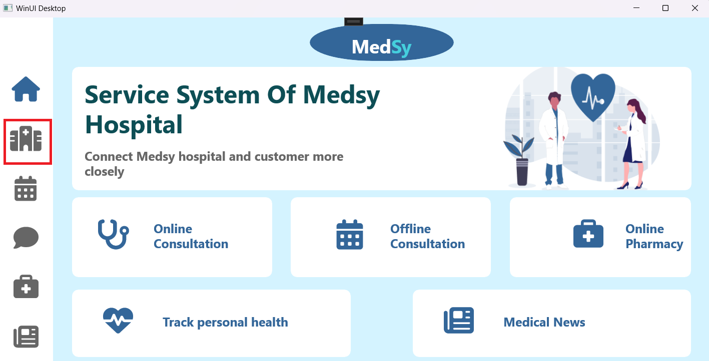

# MedSy - Đồ án môn học Lập Trình Windows
## Mục lục
- [Thông tin nhóm](#i-thông-tin-nhóm)
- [Các kỹ thuật (công nghệ) sử dụng trong đồ án](#ii-các-kỹ-thuật-công-nghệ-sử-dụng-trong-đồ-án)
- [Milestone 1](#iii-milestone-1)
    - [Làm việc nhóm](#1-làm-việc-nhóm)
    - [Các chức năng đã làm](#2-các-chức-năng-đã-làm)
    - [Hướng dẫn chạy ứng dụng](#3-hướng-dẫn-chạy-ứng-dụng-ở-milestone-1)
    - [Số giờ làm việc](#4-số-giờ-làm-việc)
    - [Điểm tự đánh giá](#5-điểm-tự-đánh-giá)
## I. Thông tin nhóm
- 22120174 - Phạm Quốc Kiệt
- 22120353 - Nguyễn Quang Thông
## II. Các kỹ thuật (công nghệ) sử dụng trong đồ án
- Áp dụng mô hình MVVM
- WinUI 3
- ExpressJS: xây dựng socket server phục vụ tính năng chat và videl call realtime
## III. Milestone 1
### 1. Làm việc nhóm
#### Phân công công việc


#### Git flow

### 2. Các chức năng đã làm
#### a. Đăng nhập
##### Kiểm thử
- Ở milestone 1, tài khoản và mật khẩu sử dụng dữ liệu cứng với username = "pqkiet854", password = "pqkiet854" với role là bệnh nhân
- Nếu username và password chính xác thì chuyển sang cửa sổ chính của ứng dụng. Ngược lại, hiển thị thông báo sai thông tin và phải nhập lại
##### Demo
- Sai thông tin


- Chuyển sang màn hình chính


#### b. Tư vấn trực tuyến thông qua nhắn tin
##### Kiểm thử
- Để kiểm thử tính năng chat realtime ở milestone 1, tạo 1 chat client web để gửi tin nhắn đến client winui. Khi chat client web gửi tin nhắn đến cho client winui, sẽ có các trường hợp:
    - Client winui đang offline: socket server sẽ lưu tin nhắn này xuống database để client winui có thể lấy được tất cả tin nhắn khi online (sẽ thực hiện khi kết nối ứng dụng winui này với database).
    - Client winui đang online, có các trường hợp:
        -  Client winui đang ở trong đoạn hội thoại với client web: cập nhật tin nhắn trực tiếp lên đoạn hội thoại
        - Client winui đang ở trong đoạn hội thoại với user khác
        - Client winui không ở trong trang chat: hiển thị 1 dấu hiệu ở thanh điều hướng để thông báo có tin nhắn tới và tắt dấu hiệu này khi người dùng chuyển qua trang chat
    - Trong từng trường hợp trên, gửi tin nhắn từ client web đến client winui để kiểm thử
- Về kiểm thử giao diện (xem chi tiết dưới demo)
    - Đảm bảo các tin nhắn được hiển thị đúng cách
    - Đảm bảo thông tin của các user khác được hiển thị đúng cách
##### Demo
- Khi client winui chưa kết nối tới bất kì user nào


- Khi client winui đang ở đoạn hội thoại với user **Lionel Messi** thì làm nổi bật button **John Doe** để thông báo có tin nhắn mới, khi nhấn vào button **John Doe** để mở đoạn hội thoại với **John Doe** thì chuyển màu nền trở lại như bình thường


- Khi có tin nhắn mới gửi đến nhưng client winui không ở trang chat


- Khi client winui ở trong đoạn hội thoại với client web


- Đảm bảo tin nhắn của người gửi và nhận được hiển thị theo style tương ứng


- Khi nhấn vào button **Lionel Messi** ở bên trái, đảm bảo thông tin tương ứng của **Lionel Messi** được hiển thị ở đoạn hội thoại


#### c. Xem danh sách bác sĩ
##### Kiểm thử
- Đảm bảo danh sách bác sĩ được hiển thị chính xác trên giao diện theo đúng bố cục đề ra, bao gồm các thông tin về tên, id, chuyên môn, giới tính, số năm kinh nghiệm

##### Điều kiện tiên quyết
- Ứng dụng đã khởi động và đăng nhập thành công.
- Dữ liệu bác sĩ có sẵn trong danh sách giả lập (sử dụng mock data).

##### Các bước kiểm thử

| Bước | Mô tả | Kết quả mong đợi |
|------|-------|------------------|
| 1    | Tạo một folder Doctor trong Services chứa DoctorMockDao nhằm tạo một danh sách giả lập chứa các bác sĩ với các thuộc tính liên quan (ID, tên, chuyên môn, giới tính, số năm kinh nghiệm,...) | Danh sách được khởi tạo thành công. |
| 2    | Tạo trang Doctor_Infor để xem danh sách bác sĩ, sử dụng Gridview để tổ chức các bác sĩ trên giao diện, hiển thị danh sách các bác sĩ. | Trang được tạo thành công, danh sách bác sĩ được hiển thị trên giao diện theo đúng format. |
| 3    | Kiểm tra số lượng bác sĩ hiển thị trong giao diện có khớp với danh sách giả lập. | Số lượng bác sĩ hiển thị đúng với số lượng trong danh sách giả lập. |
| 4    | Xác nhận thông tin từng bác sĩ hiển thị trên danh sách có đúng với các thông tin từ Mock data không | Thông tin từng bác sĩ hiển thị chính xác. |


#### d. Cho feedback về chất lượng bác sĩ
##### Kiểm thử
- Cho phép bệnh nhân đưa feedback và đánh giá sao cho bác sĩ

##### Điều kiện tiên quyết
- Ứng dụng đã khởi động và đăng nhập thành công.
- Dữ liệu bác sĩ có sẵn trong danh sách giả lập (sử dụng Mock Data).
- Dữ liệu các feedback và đánh giá của một bác sĩ có sẵn trong danh sách giả lập (sử dụng Mock Data)

##### Các bước kiểm thử

| Bước | Mô tả | Kết quả mong đợi |
|------|-------|------------------|
| 1    | Tạo một folder Feedback trong Services chứa FeedbackMockDao nhằm tạo một danh sách giả lập lưu trữ các Feedback từ một bệnh nhân đến một bác sĩ với các thuộc tính như nội dung feedback, đánh giá sao | Danh sách được khởi tạo thành công. |
| 2    | Tạo một trang DoctorDetail chứa thông tin chi tiết bác sĩ, hiển thị phần comment giúp xem và thực hiện các feedback cho bác sĩ| Trang được tạo thành công, giao diện tổ chức theo đúng format|
| 3    | Dựa trên trang Doctor_infor, khi Ckick chọn một bác sĩ thì navigate tới trang DoctorDetail để thực hiện việc xem thông tin chi tiết, thực hiện feedback và đánh giá sao | điều hướng đến được trang DoctorDetail với thông tin chi tiết đúng với thông tin của bác sĩ đã chọn ở DoctorInfor |
| 4    | Trên trang DoctorDetail, Kiểm tra thông tin phần comment (ID bệnh nhân đưa feedback, nội dung feedback, rating) có khớp với danh sách giả lập | Thông tin và số lượng hiển thị đúng theo danh sách giả lập|
| 5    | Bên trong phần comment, thực hiện đưa đánh giá bằng cách điền bình luận vào Textbox, đánh giá sao qua Rating và ấn nút comment để gửi feedback| Thông tin về bệnh nhân đánh giá, nội dung đánh giá, rating hiển thị được lên phần comment|

##### Demo
1. Đăng nhập:
- Nhập thông tin đăng nhập như bên dưới và bấm vào nút sign in
     - Username: pqkiet854
     - Password: pqkiet854
  


2. User Dashboard hiển thị lên, điều hướng qua trang Doctor_Infor (icon số 2 trên thanh navigate) để thực hiện việc xem danh sách bác sĩ:


Trang Doctor_Infor hiện lên:


Kiểm tra thấy:
- Danh sách bác sĩ hiển thị giao diện đúng số lượng (trường hợp dữ liệu giả lập rỗng, sẽ không hiển thị bác sĩ nào)
- Các thông tin trùng khớp với dự liệu giả lập
- Trên một trang hiển thị số lượng tối đa (SLTĐ) là 9 items, và có sử dụng phân trang nếu dữ liệu nhiều hơn SLTĐ đã set 

3. Click vào 1 item Bác sĩ nào đó trên trang Doctor_Infor để thực hiện điều hướng tới trang DoctorDetail (giả sử click vào item đầu tiên).
- Trang DoctorDetail được điều hướng đến, có thông tin chi tiết bác sĩ trùng khớp với dữ liệu giả lập.
- Có phần comment cho việc xem feedback của bác sĩ và hỗ trợ thực hiện Feedback (dữ liệu giả lập trùng khớp; trường hợp dữ liệu giả lập feedback rỗng hoặc DoctorID trong feedback không trùng với ID của bác sĩ trong danh sách hiện có, sẽ không hiển thị feedback)


4. Thực hiện đưa ra một feedback và đánh giá sao, sau đó nhấn gửi
- Nhập một đánh giá nào đó vào ô textbox, rating sao sau đó ấn gửi


- Thông tin hiển thị lên phần comment


- Trường hợp comment không hợp lệ (Không comment và rating nhưng bấm nút gửi, comment nhưng không rating) sẽ hiện thông báo cho người dùng
 


### 3. Hướng dẫn chạy ứng dụng ở milestone 1
1. Tải môi trường thực thi javascript NodeJS
2. Chuyển đến folder server
```bash
cd server
```
3. Cài đặt các phụ thuộc
``` bash
npm install express socket.io
``` 
4. Khởi chạy socket server
``` bash
node server.js
```
5. Chạy ứng dụng winui (folder MedSy) và đăng nhập với username và password đều là **"pqkiet854"** để vào cửa sổ chính
6. (Optional) Truy cập địa chỉ http://localhost:5555 để mở client web (client web này được xây dựng với mục đích kiểm thử tính năng chat realtime ở milestone 1)

### 4. Số giờ làm việc

| STT | Tính năng | Mô tả | Số giờ làm việc |
|-----------|-------|------------------|------------------|
| 1    | Đăng nhập | Cho phép người dùng đăng nhập bằng tài khoản của mình | 1 |
| 2    | Tìm kiếm thông tin bác sĩ | Cho phép tìm kiếm bác sĩ theo chuyên khoa, số năm kinh nghiệm, giới tính, tìm theo tên | 1 |
| 3    | Tư vấn trực tuyến | Cho phép bệnh nhân trao đổi với bác sĩ về các vấn đề liên quan đến sức khoẻ thông qua tin nhắn | 2 |
| 4    | Đánh giá và phản hồi | Cho phép bệnh nhân gửi đánh giá và phản hồi về chất lượng khám của bác sĩ| 2 |
| Tổng số giờ làm việc| | | 6 |

### 5. Điểm tự đánh giá
| STT | Tính năng | Mô tả | Điểm tự đánh giá |
|-----------|-------|------------------|------------------|
| 1    | Đăng nhập | Cho phép người dùng đăng nhập bằng tài khoản của mình | 10 |
| 2    | Tìm kiếm thông tin bác sĩ | Cho phép tìm kiếm bác sĩ theo chuyên khoa, số năm kinh nghiệm, giới tính, tìm theo tên | 9.5 |
| 3    | Tư vấn trực tuyến | Cho phép bệnh nhân trao đổi với bác sĩ về các vấn đề liên quan đến sức khoẻ thông qua tin nhắn | 9.5 |
| 4    | Đánh giá và phản hồi | Cho phép bệnh nhân gửi đánh giá và phản hồi về chất lượng khám của bác sĩ| 9.5 |
| Điểm đánh giá chung | | | 9.5 |
